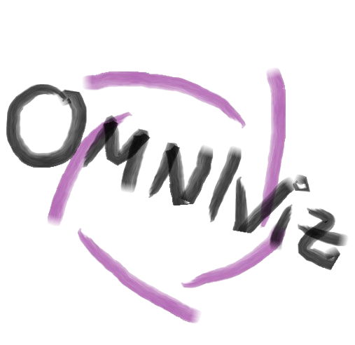

<p align="center">
  
</p>

<h1 align="center">OmniViz</h1>

> A modern Python GUI for visualizing stellarator and fusion-reactor
> geometries: JOREK boundary surfaces and HDF5 restarts, CARIDDI meshes and
> current density, Patran/VTK/VTU meshes, XYZ point clouds, 6-column vector
> fields, profiles, and current-filament wire loops — all in one **single,
> live, interactive** PyVista window.

OmniViz wraps a small typed data-loading layer around
[PyVista](https://pyvista.org/) and exposes it through a
[PySide6](https://doc.qt.io/qtforpython-6/) GUI with an **embedded** 3D view
([pyvistaqt](https://github.com/pyvista/pyvistaqt)): pick what to draw and it
appears immediately in the one persistent scene; toggle visibility, opacity,
color, colormap, and a clip plane live; switch views; export high-res figures.

---

## Features

- **Single live window.** One embedded 3D view; adding/removing an item
  updates the scene immediately — no second window, no per-render rebuild.
- **Multi-source plotting.** Combine point clouds, JOREK boundary surfaces
  (Hermite × Fourier reconstruction), JOREK HDF5 restarts, CARIDDI meshes
  (hex/tetra/wedge) and current density, Patran `.msh`, generic `.vtk`/`.vtu`
  meshes, 6-column vector fields, 2D profiles, and tilted current loops.
- **Live scene control.** Per-item visibility, opacity, color, colormap and
  scalar-bar toggles; interactive clip plane; view presets (X/Y/Z/iso/flip);
  high-res screenshot export — all from the one window.
- **Modern GUI.** PySide6 + pyvistaqt, cohesive dark/light theme, tabbed input
  panels with a live file filter, and a scene-tree dock.
- **Robust parsers.** Handles Fortran-style truncated exponents
  (`1.234-309` → `1.234E-309`) found in many fusion codes.
- **Scripting-friendly.** The `UnifiedPlotter` chain API can be used
  directly from notebooks/scripts without the GUI.

---

## Install

OmniViz requires **Python ≥ 3.10**.

### Option A — `uv` (recommended, fastest)

[Install uv](https://docs.astral.sh/uv/getting-started/installation/) if
you do not have it, then:

```bash
git clone https://github.com/sametkocbay/OmniViz.git
cd OmniViz

# Create an isolated venv and install from the lock file
uv sync --frozen

# Optional: add the JOREK HDF5 restart reader (pulls in h5py)
uv sync --extra jorek

# Run the GUI
uv run omniviz
```

`uv sync` reads `pyproject.toml` + `uv.lock` and produces a fully
reproducible `.venv/` in the project root. The GUI stack (PySide6 +
pyvistaqt) installs by default; the JOREK HDF5 reader is the optional
`jorek` extra.

### Option B — `conda` / `mamba`

```bash
conda env create -f environment.yml
conda activate omniviz
omniviz                 # or: python -m omniviz
```

This pulls `numpy`, `pandas`, `pyvista`, and `vtk` from `conda-forge`,
which is usually the smoothest path on Linux clusters that already use
conda.

### Option C — plain pip

```bash
python -m venv .venv
source .venv/bin/activate
pip install -e .
omniviz
```

---

## Usage

### GUI

```bash
omniviz             # console script (after install)
python -m omniviz   # equivalent module form
./run.sh            # uses the local .venv created by `uv sync`
```

The window has:

1. **Left dock** — tabbed input forms (Point Cloud, Boundary, VTK/VTU,
   Patran, Vector Field, CARIDDI Mesh, CARIDDI Current Density, JOREK
   Restart, Profile, Wire). Each tab shows a filterable list of files
   from `data/`, plus the options for that type, and an **Add to scene**
   button.
2. **Center** — the **embedded 3D view**. Items appear here the moment
   you add them.
3. **Right dock** — the **scene tree**: one row per item with live
   visibility, opacity, color, and (for scalar-colored items) colormap
   and scalar-bar controls, plus remove (`✕`).
4. **Toolbar / menus** — view presets (X/Y/Z/iso/flip), axes/grid/
   background toggles, interactive clip plane, **Import file…**, reload,
   high-res **screenshot export**, and a Dark/Light theme switch.

Edits in the scene tree update the embedded view live — there is no
separate render step and no second window. 2D profiles render in their
own bottom panel.

### Importing data from elsewhere

Click **Import file…** in the header to open a native file picker.
Pick any `.dat`, `.txt`, `.vtk`, `.msh`, or `.out` file from anywhere
on disk and OmniViz will:

1. Copy it into the active `data/` folder (chunked, with a progress
   bar that shows speed and ETA — cancellable).
2. Prompt before overwriting if a file of the same name already
   exists.
3. Re-categorize `data/` and refresh the panel file lists so the new
   file appears immediately in the relevant tab.

Tiny files (< 64 KiB) skip the progress dialog and copy synchronously.

### Programmatic use

```python
from omniviz.plotter import UnifiedPlotter

(UnifiedPlotter(background="white")
    .add_boundary("data/boundary.txt", n_phi=120, n_s=10, color="cyan")
    .add_point_cloud("data/xyz_gauss.dat", color="red", point_size=5)
    .add_vector_field("data/fields_xyz.dat", scale=0.1, color_by_magnitude=True)
    .add_wire(r0=1.99, z0=0.0, alfa_wire_deg=3.0)
    .set_clip_plane("y")
    .show())
```

---

## Data layout

The GUI auto-categorizes files dropped into `data/`:

| Pattern                          | Treated as       |
|----------------------------------|------------------|
| `boundary.txt`                   | JOREK boundary   |
| `*.vtk` / `*.vtu`                | VTK / VTU mesh   |
| `*.msh`                          | Patran neutral   |
| `*.h5` / `*.hdf5`                | JOREK restart    |
| `*.dat` / `*.txt` (≥ 6 columns)  | Vector field     |
| `*.dat` / `*.txt` (≤ 5 columns)  | XYZ point cloud  |

CARIDDI mesh (`x.dat` / `ix.dat` / `ixtype.dat`), current density, and 2-column
profiles are selected explicitly in their panels from the `.dat` files in `data/`.

You can point the GUI at a different directory via the Python API:

```python
from pathlib import Path
from omniviz.gui.main_window import run
run(data_dir=Path("/scratch/me/run42"))
```

---

## Project layout

```
OmniViz/
├── omniviz/                # the installable package
│   ├── __main__.py         # `python -m omniviz`
│   ├── io.py               # parsers (XYZ, vector field, boundary, Patran,
│   │                       #   CARIDDI mesh, profiles, JOREK HDF5)
│   ├── plotter.py          # UnifiedPlotter — embedded-plotter + actor tracking
│   ├── models.py           # ViewItem dataclasses (with stable ids)
│   ├── assets/             # bundled static assets (logo)
│   └── gui/
│       ├── main_window.py  # PySide6 QMainWindow + embedded QtInteractor
│       ├── qt_panels.py    # one input panel per data type
│       ├── qt_style.py     # dark/light QSS theme
│       ├── qt_icons.py     # toolbar / swatch icons
│       └── (app.py, panels.py, photo.py, … legacy CustomTkinter, unused)
├── tests/                  # parser + actor-tracking tests
├── data/                   # sample input files
├── pyproject.toml          # deps + [jorek] extra
└── README.md
```

### Design rules followed

- **Typed dataclasses for items.** Each item is a `ViewItem` subclass with a
  stable `id`, `summary()`, and `apply()` — no untyped dicts.
- **Single source of truth for parsing.** `omniviz.io` is the only place that
  touches raw data files.
- **Boundary maths split from rendering.** `reconstruct_boundary_surface()` in
  `plotter.py` is pure NumPy and reusable outside the GUI.
- **GUI ↔ logic separation.** Panels only build items; everything renders
  through the one shared `UnifiedPlotter` bound to the embedded view.
- **Live scene, threaded loads.** Queue ops map to `add/remove/update` on the
  shared plotter; heavy parsing runs off the Qt main thread.
- **Lint config.** `ruff` in `pyproject.toml` (`E/F/W/I/UP/B/C4`).

---

## Development

```bash
uv sync --extra dev          # install dev deps (ruff, pytest)
uv run ruff check .
uv run ruff format .
QT_QPA_PLATFORM=offscreen uv run pytest -q   # tests live under tests/ (headless)
```

---

## License

MIT — see `LICENSE` if present, or the `license` field in
`pyproject.toml`.
